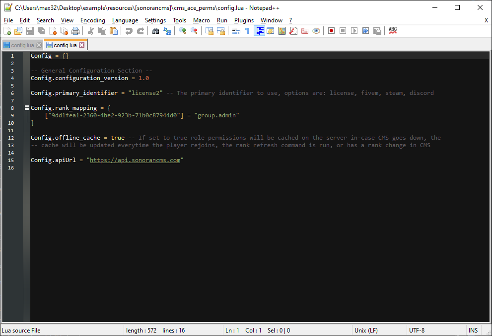
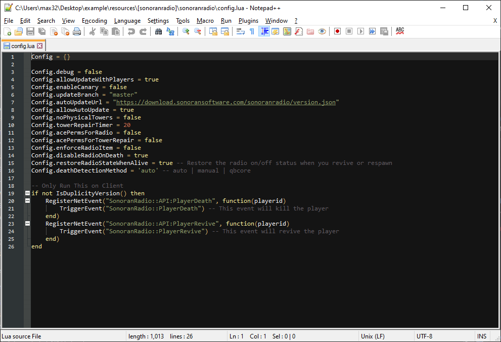

# Software Expert Installation - Next Steps

## Before you proceed...

If you have not done so already, please purchase a Windows Server product from us and reach out to our [support team](https://sonoranservers.com/contact.php) to request expert installation. This guide covers the next steps after you have completed this step...

## Subsections

Click the Subsection below that you would like to jump to:

[FiveM](software-expert-installation-next-steps.md#fivem)

[Sonoran CAD](software-expert-installation-next-steps.md#sonoran-cad)

[Sonoran CMS](software-expert-installation-next-steps.md#sonoran-cms)

[Sonoran Radio](software-expert-installation-next-steps.md#sonoran-radio)

## FiveM

### 1. Obtain FXServer License Key

1. Sign in to [keymaster ](https://keymaster.fivem.net)using a [https://forum.cfx.re](https://forum.cfx.re) account.

.png>)

&#x20;   2\. Click register to register a new license key.

.png>)

&#x20;   3\. Fill in the following information using the IP address you were sent after paying for your server.

.png>)

You will be given a page with your license information. Hover over the blurred out key and copy it for the next step.

.png>)

### 2. Configure FiveM Server Installation


FXServer requires a free license key from [https://keymaster.fivem.net](https://keymaster.fivem.net).


Once you have a FX Server license from keymaster...

1. Open `C:/FXServer/server/server.cfg` with notepad.
2. Find the line starting with `sv_licenseKey`
3. Replace the text `changeme` with the server key from keymaster.
4. Edit any other settings to your liking.
5. Save the `server.cfg` file and start your server with the `Run FivePD Server` shortcut on your Desktop.

.png>)

## Sonoran CAD

### 1. Locate your Activated Submodules

Every configuration file will be in the same folder folder. These are located in the `\sonorancad\configuration` directory.

<figure><figcaption>
SonoranCAD Configuration Folder
</figcaption></figure>

### 2. View and Change Configuration Files

For every Sonoran CAD submodule, there will be a `{pluginName}_config.lua` file present.

 (1).png>)

You can open these configuration files with a text editor and change values.

For more information on a plugin's configuration options, you can view the individual submodule guides on the [FiveM Submodules](https://info.sonorancad.com/integration-plugins/in-game-integration/fivem-installation/available-plugins) page and scroll down to the configuration section.

If you modify a configuration file, be sure to save it and `restart sonorancad` in your server console, or restart the server.

## Sonoran CMS

### 1. Locate your Installed Plugins

Every CMS addon resource installed will have a separate folder. These are located in the `\[sonorancms]\server\modules` directory.

<figure><figcaption>
Sonoran CMS - Submodules Folder
</figcaption></figure>

### 2. View and Change Configuration Files

For every Sonoran CMS submodule installed, there will be a `config.lua` or `config.json` file present.

<figure><figcaption>
Sonoran CMS - Addon Config File
</figcaption></figure>

You can open these configuration files with a text editor and change values.

For more information on a plugin's configuration options, you can view the individual plugin guides on the [Available Resources](broken-reference) page and scroll down to the configuration section.

If you modify a configuration file, be sure to save it and restart the server.

## Sonoran Radio

### 1. Locate your Installed in-game Radio files

Open the `\resources\[sonoranradio]\sonoranradio` directory.

<figure><figcaption>
Sonoran Radio - Resource Folder
</figcaption></figure>

### 2. View and Change Configuration File

For Sonoran Radio's in-game resource, there will be a `config.lua` file present.

You can open this configuration file with a text editor and change values.

<figure><figcaption>
Sonoran Radio - in-game Resource Config File
</figcaption></figure>

You can open this configuration file with a text editor and change values.

For more information on the configuration options, you can view the in-game resource's guide page and scroll down to the configuration section.

If you modify a configuration file, be sure to save it and restart the server.
