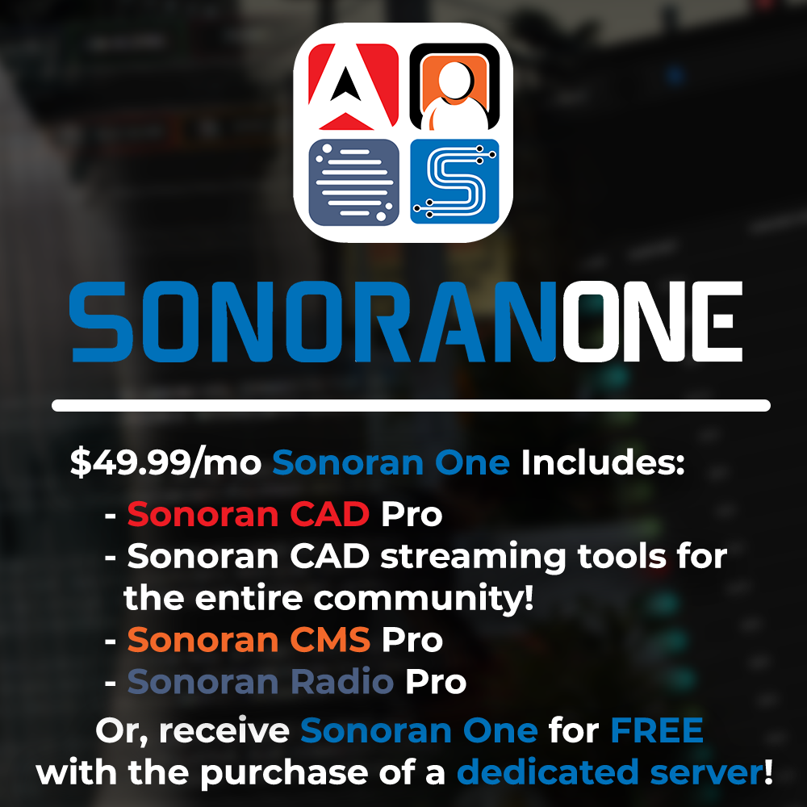

# Sonoran One - Getting Started

## What is Sonoran One?

[Sonoran One](https://sonoran.one) is our all-in-one bundle package of [Sonoran CAD](https://info.sonorancad.com/why-choose-sonoran-cad/about), [Sonoran CMS](https://info.sonorancms.com/why-choose-sonoran-cms/why-choose-sonoran-cms), and [Sonoran Radio](https://info.sonoranradio.com/en/why-choose-sonoran-radio).

Sonoran One is available for $49.99 in the Sonoran CAD, CMS, or Radio billing portal. Or, [get Sonoran one for free](30-off-software.md) with a qualified server purchase!

## After purchase, how do I activate Sonoran One?

Once you've purchased Sonoran One, all you have to do is link the subscription to your desired Sonoran CAD, CMS, and Radio community.

### Sonoran CAD

In the Sonoran CAD billing portal ([sonorancad.com/#/billing](https://sonorancad.com/#/billing)) you can [set the community ID](https://info.sonorancad.com/pricing/faq/create-and-manage-a-subscription#4.-set-your-community-id) on your new Sonoran One subscription.

### Sonoran CMS

In the Sonoran CMS billing portal ([sonorancms.com/#/billing](https://sonorancms.com/#/billing)) you can [set the community ID](https://info.sonorancms.com/pricing/pricing-faq/create-and-manage-a-subscription#migrate-a-subscription-to-another-community) on your new Sonoran One subscription.

### Sonoran Radio

In the Sonoran Radio billing portal ([sonoranradio.com/#/billing](https://sonoranradio.com/#/billing)) you can [set the community ID](https://info.sonoranradio.com/en/pricing/faq#migrate-a-subscription) on your new Sonoran One subscription.
