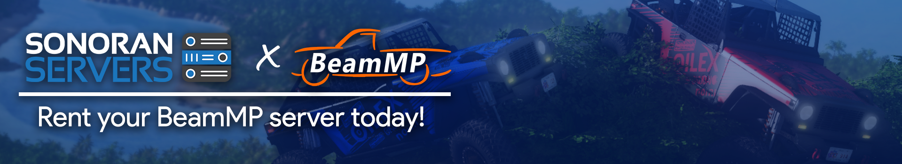

# BeamMP Setup

## Sonoran Servers x Beam MP

We're proudly partnered with Beam MP to offer instant installation with Sonoran Servers!

## Purchase Your Game Server

Sonoran Servers makes it easy to estimate what server specifications to pay for. Utilizing the game developer recommended hardware specifications we recommend based on the number of players you want to support on your game server.&#x20;


The player slots are not limited unless limited by the game developers, the slot count is just used to recommend a game server config for you. You may adjust the specifications however you would like.


### 1. Select the Game Mode

Go to the [game server configurator](https://sonoranservers.com/gameserver/#/) on our website and select BeamNG.Drive as the game you would like to purchase a game server for.

.png>)

### 2. Estimate Resource Usage

Select the number of slots you want your server to support. Make sure you that BeamMP is selected as the "**Game Mode**" and adjust any other options you would like before clicking "**ORDER NOW**" to continue.

.png>)

### 3. Purchase your Game Server

Review your order, add any additional items and fill out the information requested before checking out.

.png>)

## Configure Game Server

BeamMP will require you to create a license key and configure your server before you can get playing, follow along to find out how to use our Game Server Control Panel to do so.

### 1. Access the Client Area

Access the [Sonoran Servers Client Area](https://sonoranservers.com/clientarea.php) and click your game server from the list of your active services.

.png>)

### 2. Open the Game Server Panel

Click the green button "**Go to Panel**" to access the Game Server Control Panel.

.png>)

### 3. Login to the Game Panel

Select the option to log in with your Sonoran Servers customer login.

.png>)

### 4. Select your Server

Select your Server from the list, if this is your first game server with us there should only be one.

.png>)

### 5. Start your Game Server

Click the "**Startup**" Button on the sidebar.

.png>)

### 6. Login to Beam MP

In a new web browser window, go to [https://beamng-mp.com/k/keys](https://beamng-mp.com/k/keys) and log in with Discord when prompted.

### 7. Generate a Beam MP Key

Once logged in click the "**Keys**" link on the sidebar then click on the word "**here**" as shown below to create a new key.

.png>)

### 8. Configure your Key

Fill in a Server Name, this can be anything you choose and the Server IP. The Server IP can be viewed back on the "**Console**" tab in the Game Server Control Panel from before. For example, the IP below is "172.107.228.160"

.png>)

.png>)

### 9. Add your Key in the Game Panel

Copy the new BeamMP License Key from the page and paste it into the "**Authentication Key**" field on the Startup tab of the Game Server Control Panel. At this time you can also adjust the Max Players you would like to allow on your BeamMP server as well as the name/description you would like to show on the server list.

.png>)

## Start your Server and Connect!

Your server is now configured! Simply go to the "**Console**" tab and click "**Start**". The server console will start outputting information and you will be able to see the server resource usage at the bottom.

.png>)

### How to Connect to your Server

What's that? Don't know how to connect to your BeamMP server? Why let's show you!

First, make sure you have Installed BeamMP, you can find out more here. Once installed launch BeamMP from the start menu.

Next, I suggest clicking on the IP address shown in your Game Server Console window to copy the IP.

.png>)

In BeamNG.drive, click "**Play**", then "**Multiplayer**". If you set your server to `Private = false` in your Server.cfg file, then your server should show on the server list.

If you have trouble finding it, go ahead and direct connect!

Click "**Direct Connect**" from the left-hand sidebar, then click the "**Paste from Clipboard**" button to paste the IP you copied earlier.

.png>)

Finally, click "**Connect**" to join your BeamMP server! You should join your game server without any issues.


Due to a bug, dedicated IP addresses purchased with game servers from us will not work for the BeamMP server list. You must direct connect in order to join your server. Joining from the server list will either join another server or not connect at all.

We are waiting on the BeamMP developers to implement a fix on their end [https://github.com/BeamMP/BeamMP-Server/issues/57](https://github.com/BeamMP/BeamMP-Server/issues/57)


If you have any issues that are not covered here, feel free to reach out to our [support team for assistance](https://sonoranservers.com/contact.php).

