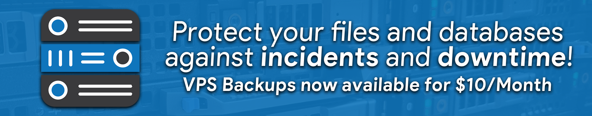

# Server Backups

<figure><figcaption></figcaption></figure>


Server Backups are only available currently for VPS Products


## VPS Server Backups

### What are VPS Backups?

Sonoran Servers includes free weekly backups with all VPS purchases, stored on-site for data loss or server issues.

Upgrade to daily backups, more restore options, and self-service backups for $10/month extra. Paid plans also recieve higher priority and faster speeds.

### How Much Do VPS Backups Cost?

VPS Backups plans are straightforward and very cost-effective.

<table><thead><tr><th width="188">Plan</th><th width="128" data-type="checkbox">Self-Service Backups*</th><th width="161">Backup Rotation**</th><th data-type="checkbox">FREE Restores*</th><th data-hidden>Self-Service Backups</th><th data-hidden>Self-Service Restores</th><th data-hidden data-type="checkbox">FREE Restores</th><th data-hidden data-type="number"></th></tr></thead><tbody><tr><td><strong>Weekly Backups - FREE</strong></td><td>false</td><td>3</td><td>true</td><td>0</td><td>2</td><td>true</td><td>null</td></tr><tr><td><strong>Daily Backups - $10/month</strong></td><td>true</td><td>10</td><td>true</td><td>2</td><td>4</td><td>true</td><td>null</td></tr></tbody></table>

\* To prevent spam, self-service backups and restores are limited to two per month. Open a ticket with [customer support](https://sonoranservers.com/contact.php) in the need of additional restores.&#x20;

\*\* Backup Rotation is the maximum number of backups that are kept at any given time for a VPS, subsequent backups override the oldest backup.

## How do I upgrade my Backup Plan?

#### 1. Purchase Backup Plan at VPS initial purchase

<figure><figcaption></figcaption></figure>

#### 2. Contact Support to upgrade your VPS Backup Plan

[Click here to Contact Support](https://sonoranservers.com/contact.php)

## Restore A Backup

### 1. Log in to Sonoran Servers

Visit the Sonoran Servers website and click "Log In" in the top right corner or [click this link](https://sonoranservers.com/index.php?rp=/login).

### 2. Navigate to Manage your VPS

Click `Manage` on your VPS you would like to Restore

<figure><figcaption></figcaption></figure>

### 3. View your Backups

Scroll down the page and click the dropdown to reveal the `Backups` option, then click the `Backups` button.

<figure><figcaption></figcaption></figure>

### 4. Select the Restore Point

Under the `Incremental Backups` View, and choose the backup you would like to restore to.


There is no turning back once you confirm the restore action, **all current data on the VPS will be lost and replaced by the backup**.


<figure><figcaption></figcaption></figure>

### 5. Wait for the Restore to complete

A progress bar will display the current restore progress. If you refresh the page or close the window, you may view the progress under the `Tasks and Logs` Tab.&#x20;

Restores typically take 1-3 hours before the VPS is fully available for use, restore/backup times are affected by the current usage of our network at any given point in time.
